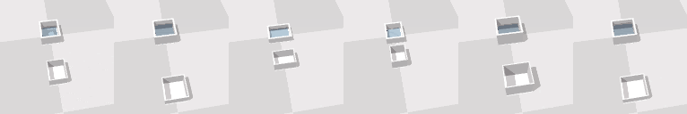
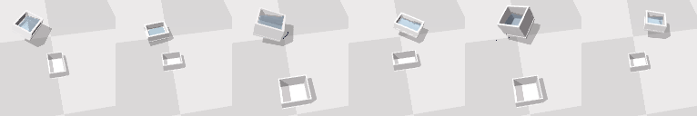

<h1 align="center">
  ToolFlowNet: Robotic Manipulation with Tools via Predicting Tool Flow from Point Clouds</h1>

<div align="center">
  <a href="http://www.cs.cmu.edu/~dseita/">Daniel Seita</a> &nbsp;•&nbsp;
  <a href="https://yufeiwang63.github.io/">Yufei Wang<sup>†</sup></a> &nbsp;•&nbsp;
  <a href="https://sarthakjshetty.github.io/">Sarthak J. Shetty<sup>†</sup></a> &nbsp;•&nbsp;
  Edward Y. Li<sup>†</sup> &nbsp;•&nbsp;
  <a href="https://zackory.com/">Zackory Erickson</a> &nbsp;•&nbsp;
  <a href="https://davheld.github.io/">David Held</a>
</div>

<h4 align="center">
  <a href="https://sites.google.com/view/point-cloud-policy/home"><b>Website</b></a> &nbsp;•&nbsp;
  <a href="https://arxiv.org/abs/2211.09006"><b>Paper</b></a>
</h4>

<p align="center">


</p>

<hr>

This is the Soft**Gym** simulation code for
<a href="https://arxiv.org/abs/2211.09006"><b>our CoRL 2022 paper</b></a>.
See <a href="https://github.com/DanielTakeshi/softagent_tfn">our other repository</a> for the Soft**Agent** code (which contains ToolFlowNet). Install *this* code first, and *then* SoftAgent.

We only support the `PourWater` tasks as we are not allowed to release code to
fully utilize the `ScoopBall` tasks. You can find the code in
`softgym/envs/mixed_media_one_sphere.py` but you will not be able to run it.

<hr>

Contents:

- [Installation](#installation)
- [Example Usage](#example-usage)
- [Demonstrations](#demonstrations)
- [Figures and Videos](#figures-and-videos)
- [Citation](#citation)

<hr>

## Installation

**First**, clone this repository and create the conda environment, named
`toolflownet`. We have tested this on Ubuntu 18.04 using CUDA 10.2 and CUDA
11.3 and have shared the resulting conda yml files. Here are the commands:

<details>
<summary>
Ubuntu 18.04, CUDA 10.2.
</summary>

Warning: the following command took about 32 minutes to complete on my machine.

```
conda env create -f softgym_tfn_environment_cuda10_2.yml
```

Activate the environment, and check that these can run without errors:

```
In [1]: import torch, torch_geometric, pytorch3d

In [2]: torch.__version__, torch_geometric.__version__, pytorch3d.__version__
Out[2]: ('1.10.0', '2.0.4', '0.6.1')

In [3]: from torch_geometric.nn import fps

In [4]: from scipy.spatial.transform.rotation import Rotation

In [5]: torch.cuda.is_available()
Out[5]: True
```

You might not need these exact versions but they are ones that have worked on
our machines.


</details>

<details>
<summary>
Ubuntu 18.04, CUDA 11.3.
</summary>

Warning: the following command took about 32 minutes to complete on my machine.

```
conda env create -f softgym_tfn_environment_cuda11_3.yml
```

Activate the environment, and check that these can run without errors:

```
In [1]: import torch, torch_geometric, pytorch3d

In [2]: torch.__version__, torch_geometric.__version__, pytorch3d.__version__
Out[2]: ('1.10.0', '2.0.4', '0.6.2')

In [3]: from torch_geometric.nn import fps

In [4]: from scipy.spatial.transform.rotation import Rotation

In [5]: torch.cuda.is_available()
Out[5]: True
```

You might not need these exact versions but they are ones that have worked on
our machines.

</details>

If neither of the above work, you might be able to install some of the packages
manually. We provide one way below using PyTorch 1.9. It assumes that you
bundle it with CUDA 10.2.

<details>
<summary>
Ubuntu 18.04, CUDA 10.2, installing some packages manually, uses PyTorch 1.9.
</summary>

Now we use the more bare-bones `softgym_tfn_simpler_env.yml` file.

```
conda env create -f softgym_tfn_simpler_env.yml
conda activate toolflownet
conda install pytorch==1.9.0 torchvision==0.10.0 torchaudio==0.9.0 cudatoolkit=10.2 -c pytorch -y
conda install -c fvcore -c iopath -c conda-forge fvcore iopath -y
conda install -c pytorch3d pytorch3d -y
conda install pyg -c pyg -c conda-forge -y
conda install ipython -y
```

See <a href="https://github.com/pyg-team/pytorch_geometric/issues/3593">this GitHub issue report</a>
for the PyTorch Geometric installation reference.

You can do some quick sanity checks of the installation by entering
`ipython` and checking that the following do not return errors:

```
In [1]: import torch, torch_geometric, pytorch3d, torchvision, scipy

In [2]: torch.__version__, torch_geometric.__version__, pytorch3d.__version__, scipy.__version__
Out[2]: ('1.9.0', '2.0.3', '0.7.1', '1.7.3')

In [3]: from torch_geometric.nn import fps

In [4]: from scipy.spatial.transform.rotation import Rotation

In [5]: torch.cuda.is_available()
Out[5]: True
```

The reason why we test the above is that at one point or another, these
statements were causing errors.

Unfortunately, doing the same but replacing the PyTorch
installation with the CUDA 11.3 version:

```
conda install pytorch==1.9.1 torchvision==0.10.1 torchaudio==0.9.1 cudatoolkit=11.3 -c pytorch -c conda-forge
```

resulted in some package conflicts when trying to install `pytorch3d`.


If the above still does not work, and you run into conda installation conflicts
when installing `pytorch` with a long error message ending with 

```
  - zlib -> libgcc-ng[version='>=11.2.0'] -> __glibc[version='>=2.17']
  - zstd -> libgcc-ng[version='>=7.5.0'] -> __glibc[version='>=2.17']

Your installed version is: 2.27
```

Then try and repeat the above but use our second version of the environment yml
file which bundles pytorch with it. (Remove the environment with `conda env remove -n toolflownet`.) 
The steps are:

```
conda env create -f softgym_tfn_simpler_env_v2.yml
conda activate toolflownet
conda install -c fvcore -c iopath -c conda-forge fvcore iopath -y
conda install -c pytorch3d pytorch3d -y
conda install pyg -c pyg -c conda-forge -y
conda install ipython -y
```

We got this setup working on one machine.

</details>


**Second**, create SoftGym files and merge FleX. This only has to be done once.

```
./create_softgym_files.sh
./merge_flex.sh
```

**Third**, obtain the following docker file if you have not done so already. You
might need a `sudo` depending on your machine.

```
docker pull xingyu/softgym
```

Start `nvidia-docker` with the following command (again `sudo` may be needed),
**with appropriate substitutions for `{CLONED_ROOT}` and `{USER}`**:

```
nvidia-docker run \
    -v {CLONED ROOT}/softgym_tfn:/workspace/softgym \
    -v /home/{USER}/miniconda3:/home/{USER}/miniconda3 \
    -v /tmp/.X11-unix:/tmp/.X11-unix \
    --gpus all \
    -e DISPLAY=$DISPLAY \
    -e QT_X11_NO_MITSHM=1 \
    -it xingyu/softgym:latest bash
```

This will put `softgym_tfn` into `/workspace/softgym` in Docker. 
**To clarify**, `{CLONED ROOT}` (i.e., the path where you cloned the repository) and `{USER}` are system-dependent. 
For example the former is usually `/home/seita` for me, and the latter is `seita`. 
You will need to adjust and insert the appropriate strings for your system.

NOTE: The above command assumes that `miniconda3` exists for your
conda environments. If you use some other conda, run the command with that
instead.

*While inside Docker*, do these commands. **Again, replace `{USER}` with your
username on the machine.**

```
root@0263da8646c2:/workspace# cd softgym/
root@0263da8646c2:/workspace/softgym# export PATH="/home/{USER}/miniconda3/bin:$PATH"
root@0263da8646c2:/workspace/softgym# . ./prepare_1.0.sh && . ./compile_1.0.sh
```

**Note:** If you're using `anaconda3` as opposed to `miniconda3`, you might run into this [error](assets/pybinderror.txt) with `pybind11`. If so, we recommend using `miniconda3` instead of `anaconda3`.

This compiles SoftGym. It will print a bunch of warnings but as long as it says
"Built target pyflex" at the end, it should be OK. You won't need to run these
commands again, unless you change something with the C++ code (in `PyFleX/`).
Look at [this pastebin][2] for an example set of commands and output from this
procedure.

**Fourth**, _outside of Docker_, in each new command line tab, get set up by
running `. ./prepare.sh`. This activates the `softgym` conda
environment and sets the appropriate `PYFLEXROOT`, where `echo $PYFLEXROOT`
should return `{CLONED ROOT}/softgym_tfn/PyFlex`.

At this point, you should be able to use some of the SoftGym functionality.
For reproducing our ToolFlowNet results, you'll need to get demonstrations, and
then to install SoftAgent (which has ToolFlowNet). Thus, proceed to the
instructions in the [Demonstrations section](#demonstrations) to get the data in
appropriate directories.

Finally, <a href="https://github.com/DanielTakeshi/softagent_tfn">install SoftAgent following this README</a>.
That repository is meant to be cloned at the same directory level:

```
{CLONED ROOT}/softagent_tfn/
{CLONED ROOT}/softgym_tfn/
```

You only need to use this code if you want to run ToolFlowNet or another policy
training procedure. You can get started with testing SoftGym without doing this
step if you'd like to just run a random or algorithmic policy.


## Example Usage

To check if SoftGym is installed correctly, you can run some of these commands
to start the environments and to test a random or algorithmic policy. You don't
need SoftAgent for these.

First, start with this:

```
python examples/random_env.py
```

which will begin a random policy for a cloth environment. You should see cloth
and two pickers flying around at random, [as shown in this example video][3].
If you are running this on a headless machine (e.g., via ssh) where the viewer
does not open up, then add `--headless 1`.

You can also try running:

```
./bash_scripts/test_pour_water.sh
```

which will show how to run an algorithmic demonstrator policy on `PourWater`.
You should see something similar to [this example video][4].


## Demonstrations

We first show how to download the demonstrations we used for the CoRL 2022
paper. Then we show how to can generate new demonstrations.


### CoRL 2022 Ingredients

To reproduce our CoRL 2022 `PourWater` results, we recommend that you use our
demonstration data. This consists of two steps: (1) getting the cache and (2)
getting the actual demonstrations.

First, obtain the cache. They should be in the `softgym` subdirectory of this
repository:

```
cd softgym/cached_initial_states/
gdown 1ie4MCMd07IMGAREn061ys7CxSBo2m0Gq
gdown 1JUAfXaoi7GT2EvKb7hzkDlis-sI3DM9Z
```

See `softgym/cached_initial_states/README.md` for additional context.

Second, obtain the demonstrations in `data_demo/`. Note that these are 7-8G:

```
cd data_demo/
gdown 1VqfLo9E6UgRZnlrujKpvzmv7YSDGVRmN
gdown 1hVYQBg9foccNGLSkT2rGVxsviLU9Xbki
tar -zxvf PourWater_v01_BClone_filtered_wDepth_pw_algo_v02_nVars_1500_obs_combo_act_translation_axis_angle_withWaterFrac.tar.gz
tar -zxvf PourWater6D_v01_BClone_filtered_wDepth_pw_algo_v02_nVars_2000_obs_combo_act_translation_axis_angle_withWaterFrac.tar.gz
```

If the `gdown` commands do not work, you can try checking [the Google Drive
folder][1] where we store the data to download there.

See our SoftAgent repository for additional information about commands to learn
from these demonstrations. The demonstrations also include GIFs for each
episode.

### Getting New Demonstrations

If you wish to generate `PourWater (3DoF)` demonstrations for additional
testing, run these two bash scripts:

```
./bash_scripts/gen_cache_pour_water_3d.sh
./bash_scripts/gen_demos_pour_water_3d.sh
```

The first one generates a set of cached environment configurations.  The next
generates demonstration data using these cached configurations. You can combine
the two stages, but this way it makes it easier to test different algorithmic
policies on the same starting configurations. The first script should run a lot
faster than the second.

Similarly, for `PourWater (6DoF)`, run these commands:

```
./bash_scripts/gen_cache_pour_water_6d.sh
./bash_scripts/gen_demos_pour_water_6d.sh
```

## Figures and Videos

Here, we show some steps for reproducing certain figures and videos from the
CoRL 2022 paper. Refer to the <a href="https://arxiv.org/abs/2211.09006">arXiv
version</a> for the figure numbers.

### Figure 1

For reproducing Figure 1 in our paper (called the "pull" figure), run:

```
./bash_scripts/gen_data_flow_pull_figure.sh
```

This will create stuff in the `data_demo` directory where it saves the GIFs of
RGB images and, in a separate file, saves the individual tool point cloud and
flow vectors. We can then stitch the images together in other software; I used
Google Drawings.

Note: you might have to run this twice, because the translation flow, in
contrast to the rotation flow, needs (1) more downsampling, and (2) a smaller
scaling factor. So, I actually ran this twice, then I viewed the flow vector
files in html, took screenshots, and then aligned them in Google Drawings.

### Test-Time Predicted Flow

To generate predicted flow from a policy at test-time, refer to our SoftAgent
repository for loading and rolling out a policy. Once I do that, I stitch the
relevant information using:

```
python examples/combo_script_rgb_pcl_flow.py
```

It will save the result in the `rollouts/` directory.  We used this code to
generate the videos on the project website. We also used similar code to
generate Figure 4 in the paper.

### Debug Point Cloud Segmentation

To debug and check that point clouds are segmented correctly, you can take the
demonstration data (see above) and run the following:

```
python examples/inspect_pcl_demo_data.py
```

This script will (slowly) produce GIFs that show the segmentation information
across time; each point in the point cloud has a color corresponding to one of
the segmentation classes. Here is [an example output GIF][5].


## Citation

If you find this repository useful, please cite our paper:

```
@inproceedings{Seita2022toolflownet,
    title={{ToolFlowNet: Robotic Manipulation with Tools via Predicting Tool Flow from Point Clouds}},
    author={Seita, Daniel and Wang, Yufei and Shetty, Sarthak, and Li, Edward and Erickson, Zackory and Held, David},
    booktitle={Conference on Robot Learning (CoRL)},
    year={2022}
}
```

[1]:https://drive.google.com/drive/folders/1rcUXqChSpUmSgl9f5WgINbahEDfU0r5A?usp=sharing
[2]:https://pastebin.com/raw/5LH1MLqK
[3]:https://drive.google.com/file/d/13glD4E2VxtcuQ0Hc8sciKmHzjv1P-X-k/view?usp=sharing
[4]:https://drive.google.com/file/d/1ZjtG7h9SHzlSJDiRi9fwuJd-iw_R2mii/view?usp=sharing
[5]:https://drive.google.com/file/d/1sxqbfN3sM1XM103IWUpJwrxDRQAzM5L0/view?usp=sharing
